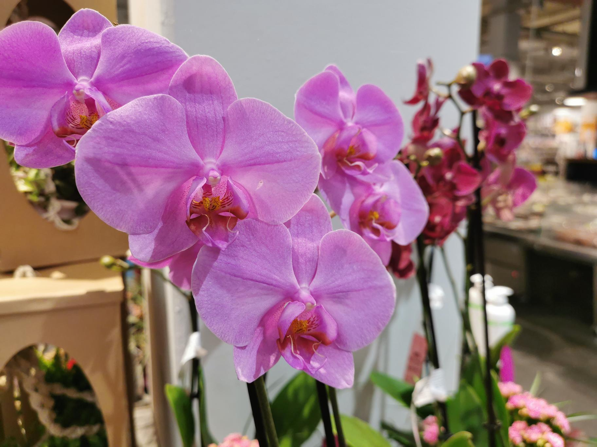

+++
title = "Website erstellen"
date = "2020-08-19"
draft = false
pinned = false
image = "microsoftteams-image.png"
description = "Wir sollten eine Website für einen Blumenladen kreieren. Dazu haben wir eigene Fotos aus der Umgebung benutzt."
+++

In den WEB-Lektionen vom 19.08.2020 haben wir begonnen eine **Website für einen Blumenladen** zu kreieren. Ich war in einem Team mit Sven. Wir haben Fotos im Casa Wankdorf von Blumen geschossen und danach begonnen eine eigene **Website auf carrd** zu erstellen. Am Ende des Nachmittags haben wir uns in der Klasse die Websites gegenseitig **präsentiert**. Insgesamt denke ich, dass die Resultate überraschend gut gelungen sind und ich bin **zufrieden mit unserem Produkt**. Ich kann mir sehr gut vorstellen, wie diese neu erworbene Fähigkeit später im Arbeitsalltag auch eine Rolle spielen kann, oder zumindest ein **praktisches Know-How** aufgebaut wurde.

Ich fand es sehr gut, wie man am Nachmittag gesehen hat, wie Marcos Idee mit der **Arbeits- und Lernphase** umgesetzt wurde.

Noah, 19.08.2020