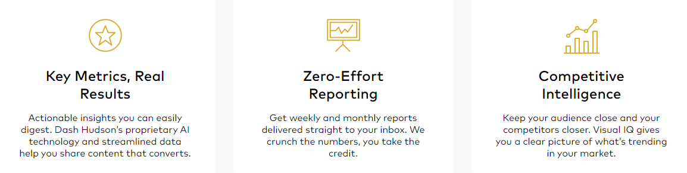

+++
title = "2. Semester: Social-Media"
date = "2021-01-27"
draft = false
pinned = false
image = "insta-analytics.png"
description = "Ich war am 27. Januar 2 Lektionen im WEB-Unterricht und habe überlegt, was wir im 2. Semester tun wollen."
+++

Ich war 2 Lektionen im WEB-Unterricht und habe überlegt, was wir im 2. Semester tun wollen. Ich habe die "Lean Canvas" Vorlage ausgefüllt. In der 3. und 4. Lektion ging ich zu unserem Kunden um mit ihm die Vorlage zu vervollständigen und einen Kompromiss zu finden. 

Grundsätzlich bin ich für die Wünsche offen, doch ich denke, dass wir uns nicht allzu weit von unserem ursprünglichen Projekt des letzten Semesters entfernen sollten. Es kann auch sein, dass ich nur etwas nervös bin, da ich diesen ganzen Prozess zum ersten Mal mache und möglichst viele gute Erlebnisse daraus mitnehmen möchte.