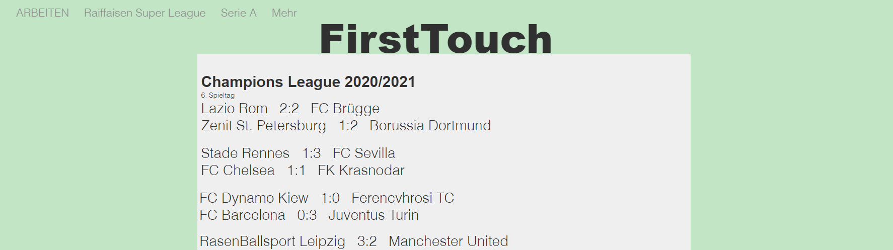

+++
title = "Arbeit und Noten"
date = "2020-12-09"
draft = false
pinned = false
image = "champions-league-firsttouch.png"
description = "Wir erhielten unsere Noten, hatten eine kurze Standortbestimmung und arbeiteten weiter an unserem Projekt."
+++

In den WEB-Lektionen vom 09.12.2020 hatten wir eine kurze Notenbesprechung/Standortbestimmung mit Marco gehabt. Danach wollten wir eigentlich mit Leuten aus dem Bildnerischen Gestalten auf einen Fussballplatz gehen und einige Fotos schiessen. Doch es begann zu schneien. Das Wetter machte uns einen Strich durch die Rechnung. 

Nun wollten im Zimmer weiterarbeiten. Wir haben die Seite Champions League auf unserer Webseite aufgesetzt. Wir haben soweit gearbeitet, dass wir nun immer die aktuellsten Resultate und Spielstände eintragen können.