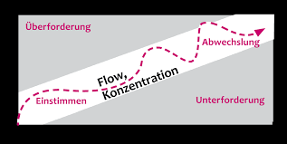

+++
title = "Arbeitsflow während der Pandemie"
date = "2020-10-28"
draft = false
pinned = false
image = "herunterladen.jpg"
description = "Wir arbeiteten in den Lektionen zuhause und kamen dabei richtig in Fahrt."
+++

Am 21. Oktober 2020 mussten wir zuhause arbeiten. Während den Lektionen konnten wir uns nicht wirklich mit unserem Projekt befassen. Wir machten nebenher andere Dinge (Bewertung erhalten; Programmieren)

Gegen Ende kamen wir jedoch immer mehr in Fahrt und entschieden uns daher noch etwas länger zu arbeiten. Wir kamen dabei in einen Flow und vergassen dabei komplett die Zeit.

Am 28. Oktober 2020 schrieben wir daraufhin das Protokoll und den Blogeintrag und würden nun die Zeit von letzter Woche kompensieren.