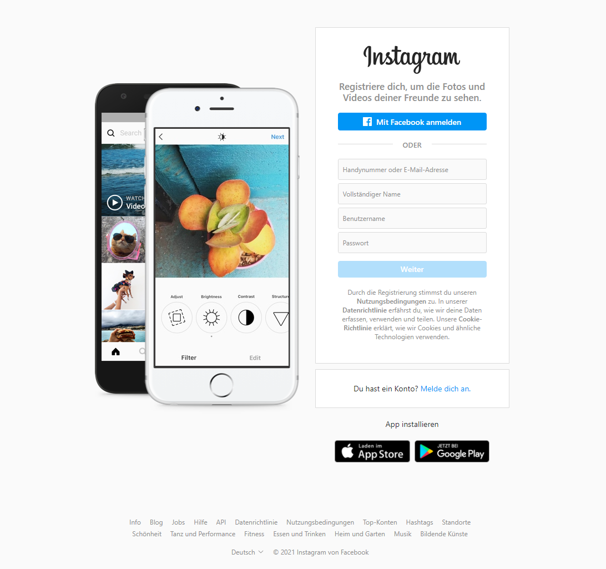
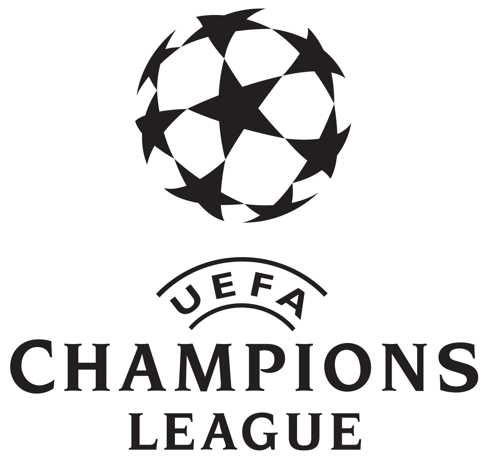

+++
title = "Champions League Liga"
date = "2021-02-24"
draft = false
pinned = false
image = "championsleague.png"
description = "Wir haben über die letzten 2 Wochen die Champions League Liga verfolgt und haben einen Instagram-Account gestartet."
+++

Webseite

Wir haben die Resultate der Champions League Liga in unserer Webseite live eingetragen. Wir haben dabei die Auswechslungen, die Tore und die Karten eingetragen. Wir sind mit unserer Webseite live gegangen und haben die Resultate in Echtzeit übertragen. Für mich war es eine neue Erfahrung, da ich sah, wie ich etwas schrieb, und eine halbe Sekunde später war es im Internet verfügbar für unsere Follower. 

Ich habe die Spiele FC Barcelona gegen Paris St. Germain und FC Sevilla gegen Borussia Dortmund angeschaut. Die Spiele waren sehr ereignisreich und ich hatte einiges zu tun. Natürlich habe ich die Spiele trotzdem genossen. Auffällig war dabei, dass in beiden Spielen sehr junge Akteure auf dem Rasen gezaubert haben.  Erling Haaland (20) traf für Borussia Dortmund doppelt, während der Franzose Kylian Mbappé (22) für Paris St. Germain einen Dreierpack erzielte.

Instagram-Account

In diesen zwei Wochen haben wir auch einen Instagram-Account erstellt um mehr Besucher auf unsere Webseite zu locken. Wir haben zum aktuellen Zeitpunkt bereits 32 Follower gewinnen können. Zu unserem Erstaunen ist von diesen Abonnenten niemand, den wir kennen oder dazu animiert haben. Wir hoffen durch regelmässige Beiträge und Stories möglichst viele Abonnenten zu gewinnen.

Unsere Webseite: 

https://noahschmidt0.wixsite.com/meinewebsite-1