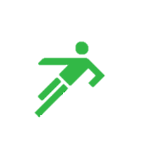
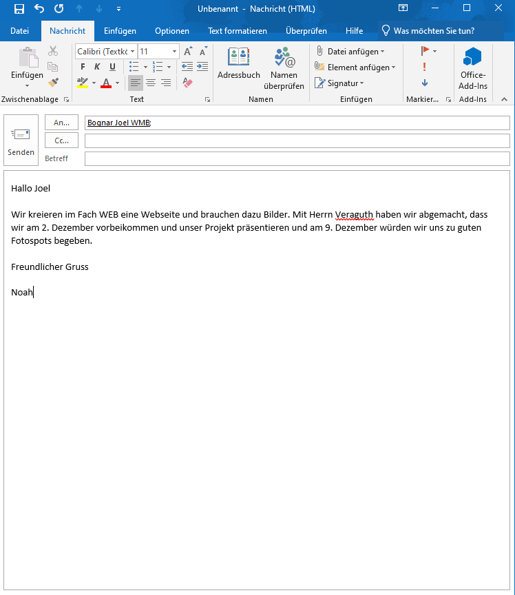

+++
title = "Fächerübergreifende Projekte - die Fotografie"
date = "2020-11-18"
draft = false
pinned = false
tags = []
image = "firsttouch-logo.png"
description = "In den WEB-Lektionen vom 18.11.2020 haben wir vier Lektionen lang am Projekt gearbeitet - ohne Mario."
+++

In den WEB-Lektionen vom 18.11.2020 haben wir vier Lektionen lang am Projekt gearbeitet. Mario bezog Kontingent und war deswegen abwesend. Sven und ich planten unsere nächsten Schritte und kreierten ein Logo. Um unsere Webseite etwas dynamischer zu gestalten haben wir bei  Herrn Veraguth angefragt, ob man mit einigen Schülern aus dem Bildnerischen Gestalten Fotos machen gehen könnte. 

Zum Abschluss haben wir geplant, dass dies folgende Schritte bezüglich dem Projekt sind:

* 25. November: Blockwoche
* 2. Dezember: Mit einigen Leuten aus dem BG Fototermin vereinbaren
* 9. Dezember: Fotos von verschiedenen fussballbezogenen Orten machen