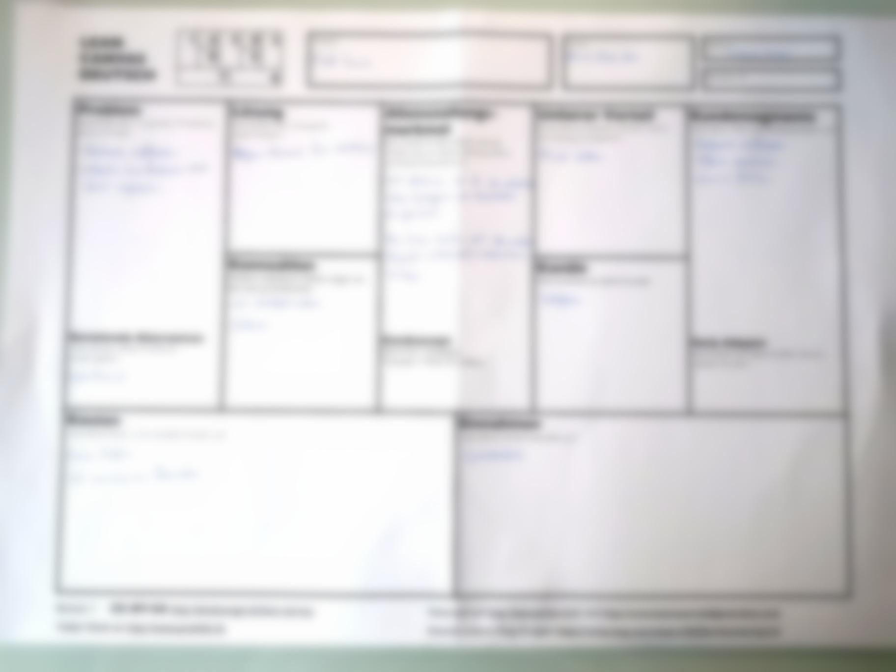

+++
title = "Interaktion mit Kunden"
date = "2021-02-03"
draft = false
pinned = false
image = "8d3eb9f4-bfb5-4ca7-ba2d-9aa89b95d27e.jpeg"
description = "Wir arbeiteten von zuhause aus an unserem neuen Projekt."
+++

Am 3. Februar arbeiteten wir von zuhause aus. Wir wollten mit unserem **neuen Projekt** beginnen. Dazu mussten wir zuerst die **CANVAS-Vorlage** ausfüllen. Wir füllten diese einzeln aus und besprachen sie im Anschluss gemeinsam. Danach erkundigten wir uns, wie man bei unserem neuen Projekt vorgeht.

**Neues Projekt:**

Wir trafen uns in den letzten zwei Wochen mit einem Spieler vom **Fussballclub Zollikofen** und stellten ihm unsere Webseite aus dem ersten Semester. Diese konnte aber den Wunsch unseres Kunden nicht erfüllen, da der Fussballclub eher an **Promoting** interessiert wäre. Also haben wir uns darauf geeinigt, dass wir im zweiten Semester im WEB einen **Instagrammaccount** erstellen und führen.

 Da im Moment aufgrund von Corona nicht gespielt wird, ist es eine gute Gelegenheit für uns, erste Schritte zu wagen. Wir wollen eine **gute Basis** bilden, um später während der Saison darauf aufbauen zu können