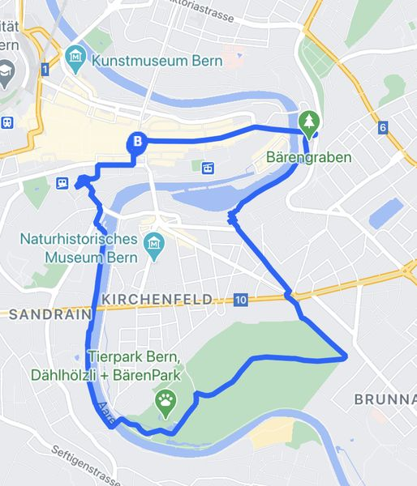

+++
title = "Joggen - der Frühling ist da!"
date = "2021-03-31"
draft = false
pinned = false
image = "kann-man-löschen.jpg"
description = "Heute haben wir als Gruppe die Jogging-Route von Sri und Alina getestet."
+++

Heute testeten wir die Jogging-Route von Sri und Alina, die sie in ihrem Projekt erstellt haben. Zeitlich passte das Ganze sehr gut, da im Moment die Länderspielpause im Fussball ist, und erst nächste Woche wieder Champions League läuft.

Wir bekamen letztes mal den Auftrag, das heisst sie sagten uns was wir zu tun hatten, um sie optimal unterstützen zu können.

Nach dem Mittag starteten wir beim Zytglogge-Turm. Wir machten uns der Aare entlang auf den Weg. Als wir den Schönausteg überquerten, kamen wir etwas durcheinander. Wir gingen einen falschen Weg, doch als wir auf die Karte schauten, fanden wir ziemlich schnell wieder in die Spur.

Der QR-Code, den Alina uns sendete funktionierte nicht (auf Svens Handy), wir wissen nicht woran es gelegen hat, aber das sollte man anpassen, da ich persönlich denke, dass der QR-Code sonst sehr gut und praktisch einsetzbar wäre.

Im Verlauf des Nachmittags merkte ich, wie ich ziemlich schnell müde wurde. Dies hatte mit meiner Pollenallergie zu tun. Ich brauchte daher einige Verschnaufpausen. Generell merkte man bei allen von uns, dass man sich im letzten Jahr weniger bewegt hat und etwas ausser Form war. 

Ansonsten denke ich haben die beiden eine tolle Route zusammengestellt, da man wirklich viele verschiedene schöne Orte in Bern besucht. 

Bei schönem Wetter wie heute kann ich die Route jedem empfehlen!