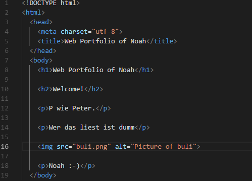
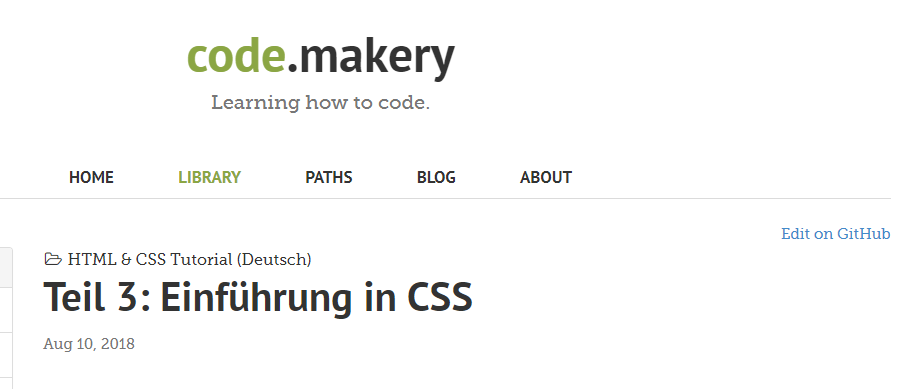

+++
title = "Programmieren und Projektarbeit Vol.2"
date = "2020-11-11"
draft = false
pinned = false
image = "bild-von-website.png"
description = "In den WEB-Lektionen vom 11. November 2020 haben wir mit programmieren und am Projekt arbeiten weitergemacht."
+++

Wir haben in den WEB-Lektionen vom 11. November 2020 mit dem Programmieren weitergemacht. Ich kam dabei sehr gut vorwärts und konnte grosse Fortschritte erkennen. 

In den zwei letzten Lektionen haben wir in der Gruppe am Projekt TwoTouch weitergearbeitet. Dabei arbeiteten wir die Lücken auf, die wir über die letzten Wochen verteilt leider machten. Nun sind wir aber bereit wieder voll durchzustarten.