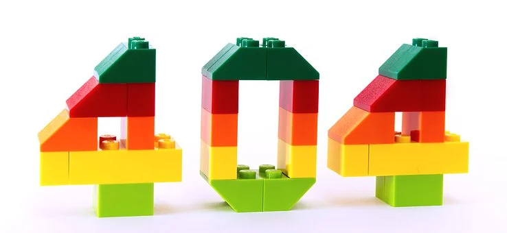

+++
title = "Programmieren und Projektmanagement"
date = "2020-11-04"
draft = false
pinned = false
image = "error-2129569__340.webp"
description = "In den WEB-Lektionen vom 04. November 2020 haben wir programmiert und begonnen unser Projekt richtig zu managen. "
+++

In den WEB-Lektionen vom 04. November 2020 haben wir programmiert und unser Projekt gemanagt. Wir haben dank Marco erkannt, dass uns einige Probleme und Fehler unterlaufen sind, die wir in den nächsten Wochen beheben um ein tolles Endprodukt einer Sportseite zu kreieren.

Beim programmieren habe ich erkannt, dass es ist, als ob ich eine neue Sprache gelernt hätte. Es war teilweise schwierig alles nachvollziehen zu können.