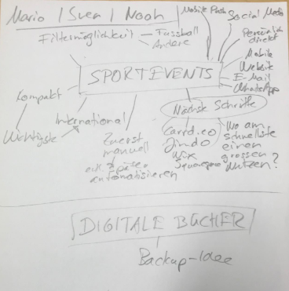

+++
title = "Projekt FirstTouch"
date = "2020-09-02"
draft = false
pinned = false
image = "mindmpa.png"
description = "Wir begannen unsere Planung zum Projekt um das Thema Sportevents."
+++

In den WEB-Lektionen vom 02.09.2020 haben wir in unserer Gruppe anfangs unsere **Ideen und Visionen mit Marco besprochen**. Wir legten dabei den Fokus auf unser **Projekt Sportevents**. Zusammen mit Marco entwarfen wir dabei ein grobes **MindMap** über unseren Arbeitsablauf. Die Idee **"Digitaler Schulstoff"** behielten wir als Backup-Idee. Wir besprachen die nächsten Schritte und legten bald darauf los. 

Wir begaben uns in einen Gruppenraum und diskutierten über das Thema **Social Media** bezüglich Werbung und Kontakten. Wir besprachen auch die **nächsten Schritte** und wie wir vorgehen wollen. Über das Wochenende wollen wir verschiedene **Informationsvideos und Tutorials** über die diversen Website-Erstellungswebsites anschauen und uns in einer **Teams-Konferenz** definitiv auf eine einigen.

Wir wollen dabei in unserem Projekt die Arbeiten, welche auch in Einzelarbeit erledigt werden können alleine erledigen um am Mittwochnachmittag **voll und ganz durchstarten** zu können. Wir wollen in der verfügbaren Zeit maximal **produktiv und fokussiert arbeiten**.