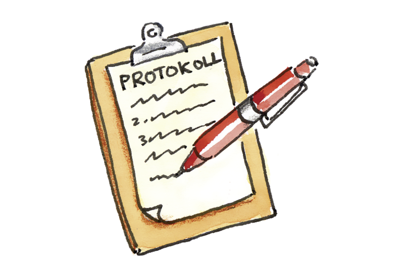

+++
title = "Protokolle und Projekte"
date = "2020-09-09"
draft = false
pinned = false
image = "protokoll-2.jpg"
+++

**Was muss in einem Protokoll sein?**

\- Datum und Uhrzeit

\- Ort der Sitzung

\- Die wichtigsten Punkte festhalten

\- Unterschrift

**Diese Punkte müssen in jedem Protokoll vorhanden sein!**

In unserem Projekt der Sportevents haben wir am Sonntag dem 06.09.2020 eine **Recherche** und einen **Teams-Call** abgehalten. Wir haben dabei das Programm **wix.com** ausgewählt weil es über Funktionen verfügt, die uns von grossem Nutzen sein können. Wir haben dabei die **Mobile-Funktion** als sehr grossen Vorteil empfunden, da unser Projekt von diesem profitieren könnte. Wir denken die Mobile-Funktion ist wichtig, da unser Projekt auf **Aktualität** basiert und heutzutage jedermann über ein Smartphone verfügt.

Wir sind sehr begeistert, die nächsten Schritte in Angriff zu nehmen.