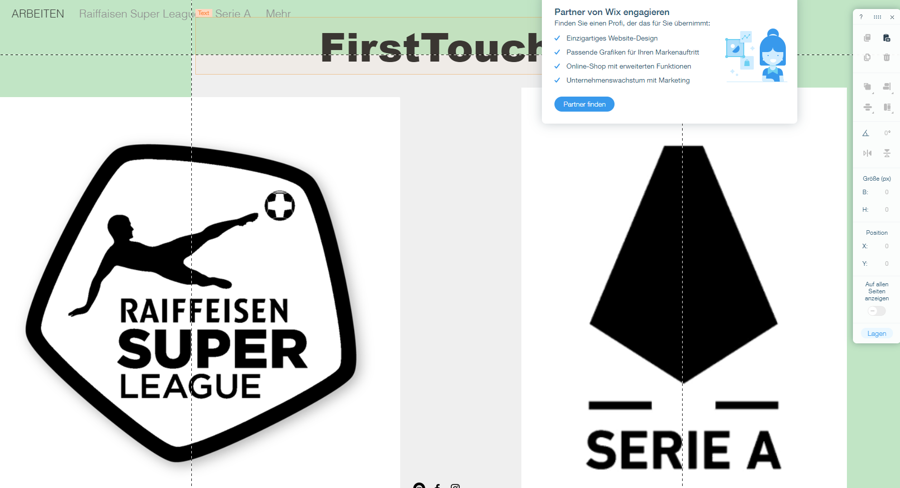

+++
title = "Webseite und Fotografie"
date = "2020-12-02"
draft = false
pinned = false
image = "wix-02.12.2020.png"
description = "Am 02.12.2020 haben wir an unserer Webseite weitergearbeitet und haben zusammen mit der BG-Gruppe die Planung für die Fotografie entworfen."
+++

In den WEB-Lektionen vom 02.12.2020 haben wir zuerst die nächste Notenvergabe besprochen. Danach haben wir unsere Webseite kurz vorgestellt und später daran weitergearbeitet. 

Später gingen wir mir der BG-Gruppe nach draussen und besprachen den Vorgang vom 09.12.2020. Wir besprachen welches Material wir brauchen und was das Ziel ist. Wir gingen danach nach draussen und gingen zu verschiedenen Fussballplätzen, wo wir Fotos aufnehmen wollen.

Nun wollen wir am 09.12.2020 losgehen und mit der BG-Gruppe die Fotos schiessen und danach gemeinsam bearbeiten. Wir denken, dass sie noch einige Tipps und Tricks auf Lager haben, die uns helfen könnte!